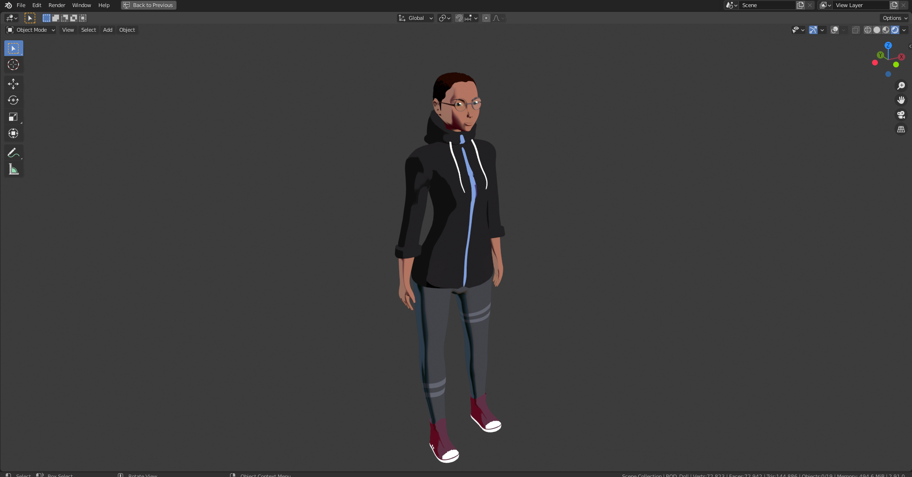
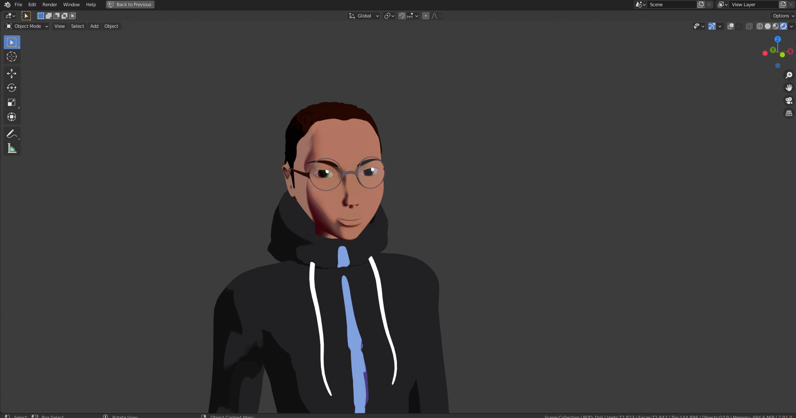
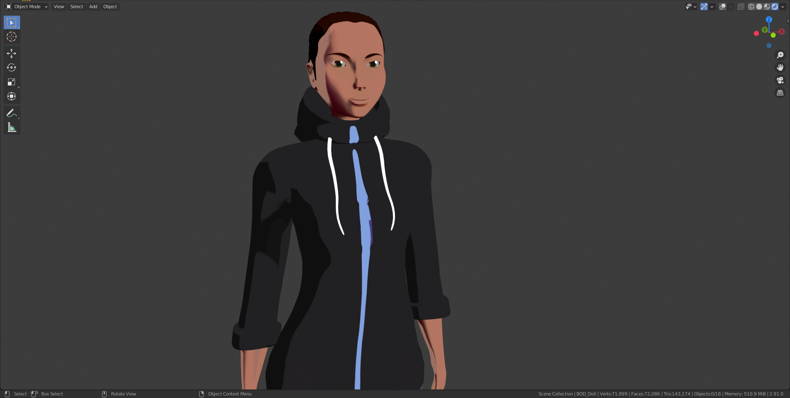

---

# Project Conversations
- *Despicable working title*

  > Blessed be the words of fools, for their speech masks mine own ignorance - *Anonymous madmen*

---

### Independent Graduate, **Narrative-driven** Video Game Project

## Wonderous Blank Space
  > To be utilized soon

---

## Lamentable ***TODO*** List

---

- [x] Upload *DEV Folder* to ***Github***
- [ ] **Update** Attributions file with ***ALL*** borrowed reference images & tutorials
  > Blessed be the open community of artists and programmers

- [ ] Feed **Hubristic progression**
  > Add newly taken images

- [ ] Finish retopology of nameless character mesh

- [ ] Finish retexturing of nameless character

- [ ] Adjust meta-rig & armature of nameless character

- [ ] Continue development of stylized **Unity Cel Shader**

- [ ] Continually update lamentable tasks list

## Hubristic Progression

---

- Nameless Character Sheet (v1)

  - 

- Nameless Character Model v1 (Base 1)
  - 

- Nameless Character Model v1 (Base 2)
  - 

- Nameless Character Model v1 (Base 3)
  - 
